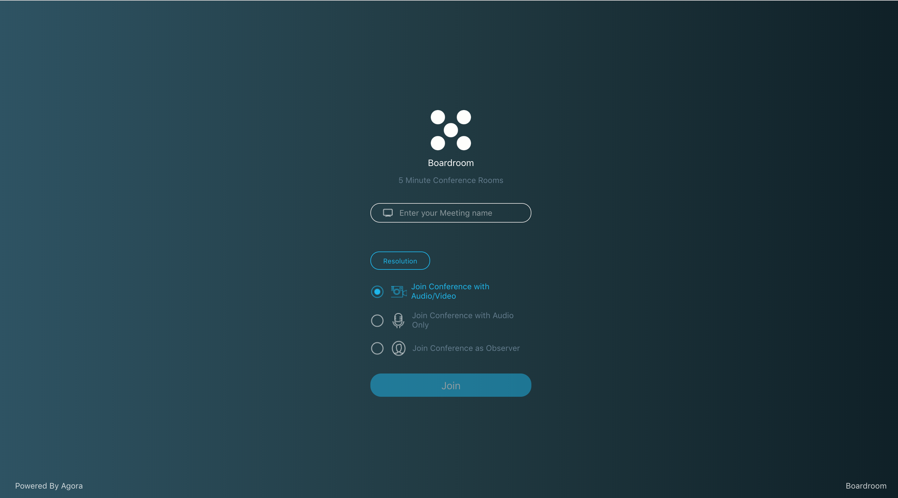

<p align="center">
    
</p>

# Boardroom
---

Boardroom is a free RTC app focused on fast, high-quality web meetings.

App is available at: <a href="cbonoz.github.io/agora" target="_blank">Boardroom: Five Minute Web Conferences</a>!

## Concept
Meetings can often be long and drawn out. This platform leverages Agora to create a fast and easy web conference platform. Features:

* Each meeting is capped at 5 minutes, at which point the session will expire and a new one must be created. Timers are synchronized across attendees.
* Audio and Video metrics toggleable for each stream.
* Full conference, Audio, and Observer participant modes offered.

Join a meeting room contains 7 people at most (audiences will not be counted) with custom configuration

Submitted for the Agora Video RTC Web Challenge:
https://agora.devpost.com/

Going after the following:
1. Quality Transparency: Users are able to have a live stream of both Audio <b>and</b> Video
2. Device Management: Users are able to control the resolution of their default device, as well as the pixel rate.
3. Volume Indicator: Audio stats provide information about each person's audio output and data receival rates.

### Screenshots




## Local Dev Notes
First, create a developer account at [Agora.io](https://dashboard.agora.io/signin/), and obtain an App ID.

Update "agora.config.js" in "/src" with your App ID.

``` javascript
export const AGORA_APP_ID = 'abcdefg'
```

Run yarn to install dependencies and start the sever
<pre>
    yarn && yarn start
</pre>
